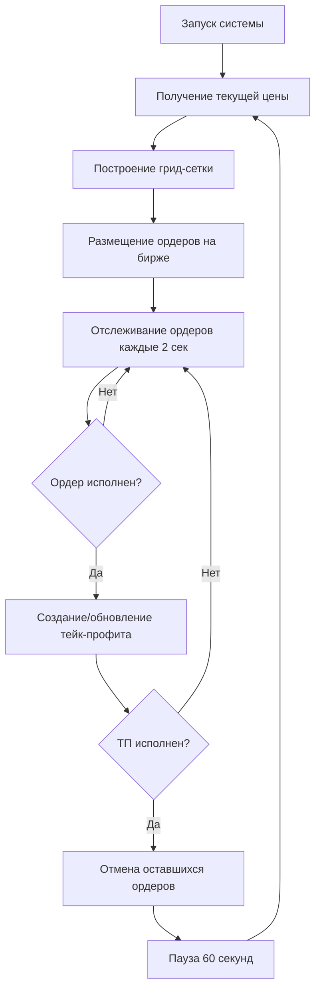
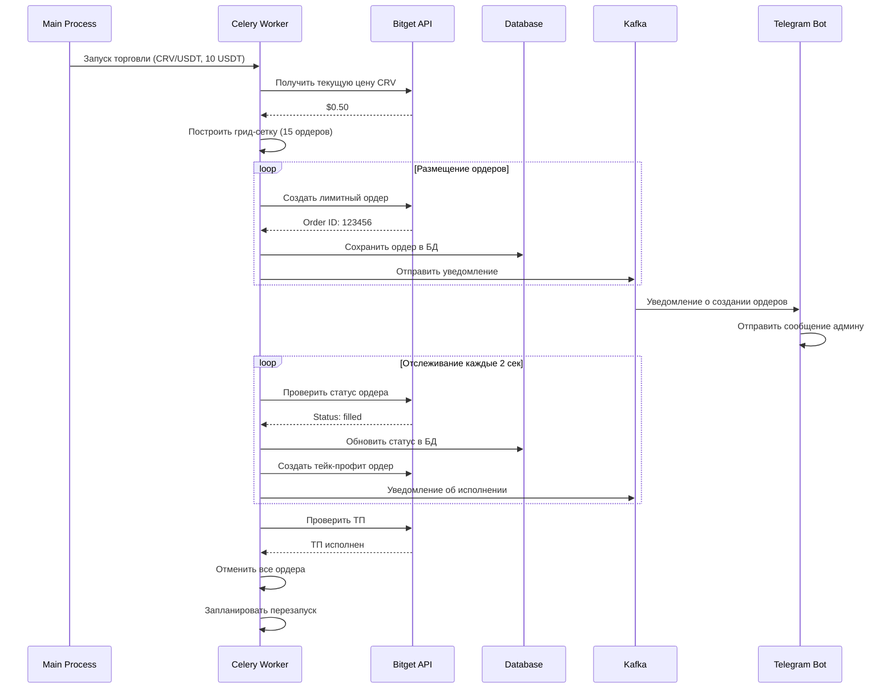

# 🏗️ Архитектура системы BotFeature

## 🔄 Схема работы торговой стратегии



## 💼 Структура компонентов

```
🏗️ BotFeature
├── 🎯 Main Process (main.py)
│   ├── Инициализация БД
│   ├── Запуск Celery задач
│   └── Запуск Telegram бота
│
├── 🔧 Celery Workers
│   ├── start_master_trading
│   │   └── Создает задачи для каждой монеты
│   ├── start_symbol_trading  
│   │   ├── Настройка плеча/маржи
│   │   ├── Построение грид-сетки
│   │   └── Размещение ордеров
│   ├── track_symbol_continuously
│   │   ├── Проверка статусов ордеров
│   │   ├── Обновление тейк-профита
│   │   └── Определение необходимости перезапуска
│   └── restart_symbol_after_delay
│       └── Перезапуск после ТП
│
├── 🔌 Bitget API Client
│   ├── Rate Limiting (100 req/min)
│   ├── Connection Pooling  
│   ├── Error Handling
│   └── Automatic Reconnection
│
├── 💾 Database Layer (SQLite)
│   ├── limit_orders - активные лимитные ордера
│   ├── take_profit_orders - ордера ТП
│   └── users - пользователи системы  
│
├── 📨 Notification System
│   ├── Kafka Producer → Topics
│   ├── Kafka Consumer → Telegram Bot
│   └── Admin Notifications
│
└── 🛡️ Security & Utils
    ├── Encryption (Fernet)
    ├── Rate Limiting
    └── Logging System
```

## 📊 Поток данных



## 🔢 Математическая модель грид-стратегии

### Расчет базового количества:
```
available_amount = deposit_amount × leverage
available_amount = 10 USDT × 20 = 200 USDT

total_multiplier = Σ(martingale_multiplier^i) for i in range(grid_levels)
total_multiplier = 1 + 1.3 + 1.69 + 2.197 + ... ≈ 142.8

base_quantity = available_amount / (total_multiplier × current_price)
base_quantity = 200 / (142.8 × 0.50) ≈ 2.8 CRV
```

### Распределение уровней сетки:
```
current_price = $0.50
coverage_percent = 0.40
min_price = current_price × (1 - coverage_percent) = $0.30
price_step = (current_price - min_price) / (grid_levels - 1)
price_step = ($0.50 - $0.30) / 14 ≈ $0.0143

Уровни:
Level 0 (Market): $0.500 - 2.8 CRV
Level 1: $0.486 - 3.64 CRV  
Level 2: $0.471 - 4.73 CRV
...
Level 14: $0.300 - 400+ CRV
```

### Расчет тейк-профита:
```
Допустим исполнилось 3 ордера:
Order 1: 2.8 CRV по $0.486 = $1.36
Order 2: 3.64 CRV по $0.471 = $1.71  
Order 3: 4.73 CRV по $0.457 = $2.16

total_quantity = 2.8 + 3.64 + 4.73 = 11.17 CRV
total_cost = $1.36 + $1.71 + $2.16 = $5.23
average_price = $5.23 / 11.17 = $0.468

take_profit_price = average_price × (1 + take_profit_percent)
take_profit_price = $0.468 × 1.02 = $0.477

Прибыль = (11.17 × $0.477) - $5.23 = $0.106 (≈2%)
Доходность от депозита = $0.106 / $10 = 1.06%
```

## 🔧 Конфигурация системы

### Redis Queues:
```
Queue 'trading': Запуск новых торговых сессий
Queue 'tracking': Отслеживание существующих ордеров  
Queue 'restart': Перезапуск после тейк-профита
Queue 'notifications': Уведомления и алерты
```

### Celery Configuration:
```python
worker_prefetch_multiplier = 1      # Один таск на воркер
task_acks_late = True               # Подтверждение после выполнения
worker_max_tasks_per_child = 1000   # Перезапуск воркера
task_soft_time_limit = 300          # Мягкий лимит 5 мин
task_time_limit = 600               # Жесткий лимит 10 мин
```

### Database Indexes:
```sql
-- Оптимизация запросов
CREATE INDEX idx_limit_orders_symbol_status ON limit_orders(symbol, status);
CREATE INDEX idx_tp_orders_symbol_status ON take_profit_orders(symbol, status);
CREATE INDEX idx_orders_created_at ON limit_orders(created_at);
```

## 🔒 Безопасность

### API Keys Encryption:
```python
# Все API ключи шифруются перед сохранением
from cryptography.fernet import Fernet

cipher = Fernet(ENCRYPTION_KEY)
encrypted_key = cipher.encrypt(api_key.encode())
# Сохраняется только encrypted_key
```

### Rate Limiting Strategy:
```python
class RateLimiter:
    max_requests_per_minute = 100
    max_concurrent_requests = 5
    backoff_strategy = "exponential"
    retry_attempts = 3
```

## 📈 Мониторинг метрик

### Ключевые метрики для отслеживания:

1. **Торговые метрики:**
   - Количество активных ордеров
   - Процент исполненных ордеров
   - Средняя прибыль с ТП
   - Количество перезапусков в день

2. **Системные метрики:**
   - Latency API запросов
   - Количество failed запросов
   - Использование памяти Redis
   - Размер очередей Celery

3. **Финансовые метрики:**
   - Общий P&L за период
   - Максимальная просадка
   - Sharpe ratio стратегии
   - Комиссии биржи

### Алерты и уведомления:
```python
# Критические события для уведомлений:
- API ключи недействительны
- Недостаток средств на счету  
- Превышение лимитов API
- Системные ошибки > 5 подряд
- Просадка > 20% от депозита
- Остановка торговли > 10 минут
```

## 🔧 Производительность и оптимизация

### Оптимизация API запросов:
- **Batch requests**: Группировка проверок ордеров
- **Caching**: Кеширование статусов на 1-2 секунды
- **Connection pooling**: Переиспользование соединений
- **Graceful degradation**: Работа при частичных сбоях API

### Оптимизация базы данных:
- **Connection pooling**: Пул соединений для SQLite
- **Batch updates**: Групповые обновления статусов
- **Правильные индексы**: Оптимизация запросов
- **Cleanup старых записей**: Автоочистка истории

### Масштабирование:
- **Horizontal scaling**: Несколько Celery воркеров
- **Queue partitioning**: Разделение по типам задач  
- **Redis clustering**: Для высоких нагрузок
- **Database sharding**: При большом количестве ордеров

---

*Эта архитектура обеспечивает надежную, масштабируемую и эффективную торговую систему с минимальными задержками и максимальной прибыльностью.*
